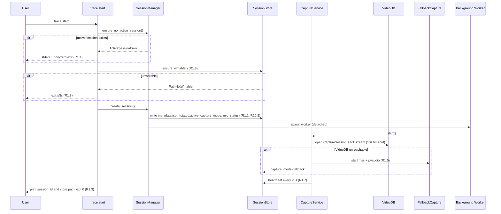
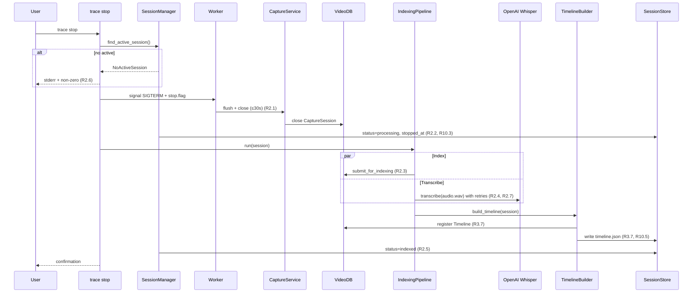
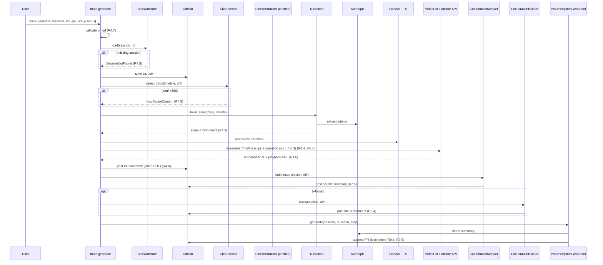
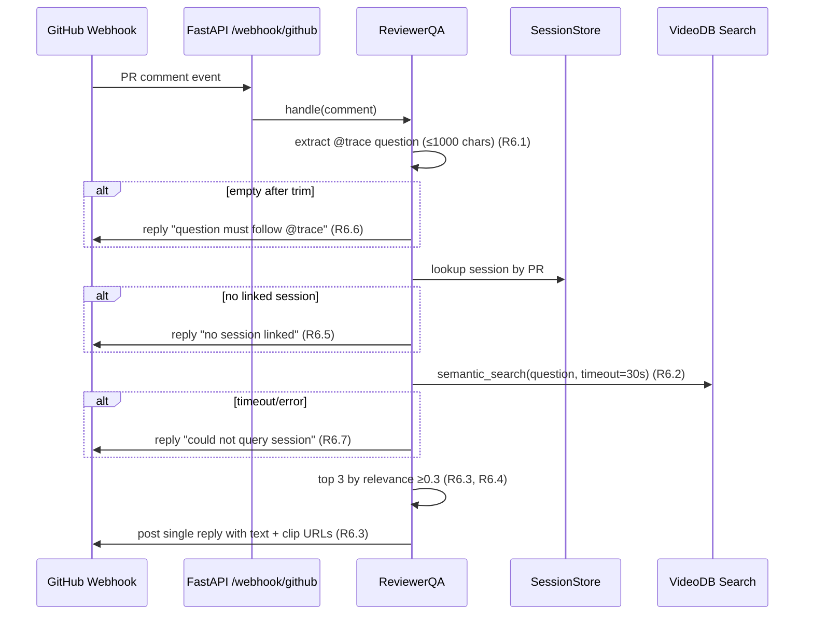
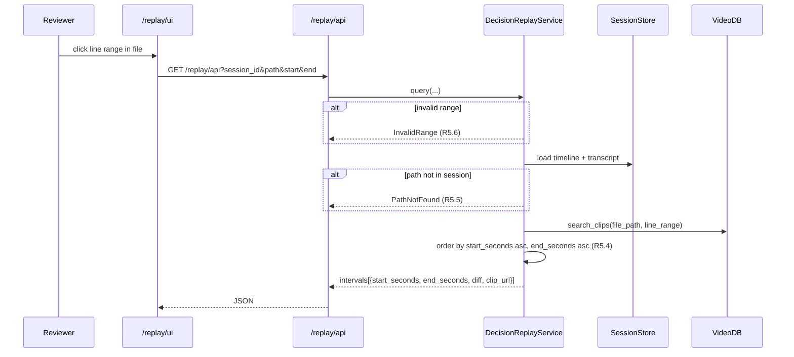

# Design Document

## Overview

Trace is a single-process Python 3.11+ CLI plus a small embedded FastAPI app that records a developer's coding session, indexes it through VideoDB, and produces PR artifacts (video walkthrough, contribution map, focus mode, description, decision replay, reviewer Q&A). The design is shaped by three constraints from `BUILD_PLAN.md`:

1. **VideoDB-first.** CaptureSession, RTStream, indexing/semantic search, and the Timeline API must each be the load-bearing component for at least one feature, and that usage must be visible in the demo. The architecture pushes capture, search, and assembly through VideoDB; local fallbacks exist only as escape hatches.
2. **48-hour solo build.** Single Python process, asyncio for I/O concurrency, no message queues, no service decomposition, no auth beyond API keys, file-system-based session store.
3. **Vertical demo slice.** Capture → Timeline → PR Video is the spine. Decision Replay, @trace Q&A, Contribution Map, Focus Mode, and PR Description plug into the same indexed session — they don't run parallel pipelines.

The CLI surface is intentionally small: `trace start`, `trace stop`, `trace generate`, plus auxiliary commands `trace replay` (CLI form of decision replay) and `trace serve` (runs the FastAPI app for the web replay UI and the GitHub webhook). All four external integrations (VideoDB, OpenAI Whisper + TTS, Anthropic, GitHub API) are wrapped behind thin client modules so the rest of the code never imports vendor SDKs directly.

### Requirement Traceability At a Glance

| Component                       | Primary Requirements           |
|---------------------------------|---------------------------------|
| `trace_cli.cli`                 | R1, R2, R4, R8 (`--focus`), R11 |
| `SessionManager` + `SessionStore` | R1.1, R1.7, R1.8, R2.1, R2.2, R10 |
| `CaptureService` (VideoDB)      | R1.2, R1.5, R1.6, R2.1, R2.2   |
| `FallbackCapture` (mss/pyaudio) | R1.5, R1.6, R10.4              |
| `IndexingPipeline`              | R2.3–R2.8                      |
| `TimelineBuilder`               | R3                              |
| `PRVideoGenerator`              | R4                              |
| `DecisionReplayService`         | R5                              |
| `ReviewerQA` (FastAPI webhook)  | R6                              |
| `ContributionMapper`            | R7                              |
| `FocusModeBuilder`              | R8                              |
| `PRDescriptionGenerator`        | R9                              |
| `Credentials`                   | R11                            |

## Architecture

### High-Level Component Diagram

```mermaid
graph TB
    subgraph CLI[trace CLI]
        START[trace start]
        STOP[trace stop]
        GEN[trace generate]
        REPLAY[trace replay]
        SERVE[trace serve]
    end

    subgraph Core[Core Library]
        SM[SessionManager]
        SS[SessionStore<br/>~/.trace/sessions/]
        CS[CaptureService]
        FC[FallbackCapture<br/>mss + pyaudio]
        IP[IndexingPipeline]
        TB[TimelineBuilder]
        PV[PRVideoGenerator]
        DR[DecisionReplayService]
        QA[ReviewerQA]
        CM[ContributionMapper]
        FM[FocusModeBuilder]
        PD[PRDescriptionGenerator]
        CRED[Credentials]
    end

    subgraph Web[FastAPI App]
        WH[/webhook/github]
        UI[/replay/ui]
        API[/replay/api]
    end

    subgraph External[External Services]
        VDB[(VideoDB<br/>CaptureSession,<br/>RTStream,<br/>Index,<br/>Semantic Search,<br/>Timeline API)]
        OAI[(OpenAI<br/>Whisper + TTS)]
        ANT[(Anthropic<br/>Claude)]
        GH[(GitHub API)]
    end

    START --> SM
    STOP --> SM
    GEN --> PV
    GEN --> CM
    GEN --> FM
    GEN --> PD
    REPLAY --> DR
    SERVE --> WH
    SERVE --> UI

    SM --> SS
    SM --> CS
    SM --> IP
    CS -.fallback.-> FC
    IP --> TB

    PV --> TB
    PV --> VDB
    PV --> OAI
    PV --> ANT
    PV --> GH

    DR --> VDB
    DR --> SS

    WH --> QA
    QA --> VDB
    QA --> GH

    CM --> SS
    CM --> GH
    FM --> TB
    FM --> GH
    PD --> ANT
    PD --> GH

    CS --> VDB
    IP --> VDB
    IP --> OAI
    TB --> VDB
    TB --> ANT

    UI --> API
    API --> DR

    CRED -.reads env.-> CS
    CRED -.reads env.-> IP
    CRED -.reads env.-> PV
    CRED -.reads env.-> QA
    CRED -.reads env.-> GH
```

### Process Model

A single Python process per command. `trace start` is special: it spawns a detached background worker (the CaptureService event loop) that owns the VideoDB CaptureSession until `trace stop` signals it. The worker writes a `pid.lock` file into the session directory; `trace stop` reads it and sends a graceful-shutdown signal (SIGTERM on POSIX) plus a `stop.flag` file as a fallback signal mechanism. `trace serve` runs an independent FastAPI process on a configurable port.

### VideoDB Usage Map (depth-of-VideoDB scoring)

VideoDB is intentionally referenced in five distinct components to maximize visible usage:

| VideoDB API           | Component(s) using it                    | What it does                                      |
|-----------------------|-------------------------------------------|---------------------------------------------------|
| **CaptureSession**    | `CaptureService`                          | Owns the recording lifecycle (R1.2, R2.1)        |
| **RTStream**          | `CaptureService` (screen + mic streams)   | Streams 15+ FPS video and 16kHz audio (R1.2)     |
| **Indexing API**      | `IndexingPipeline`                        | Indexes the session for search and timeline (R2.3, R3.4) |
| **Semantic Search**   | `ReviewerQA`, `PRVideoGenerator`, `DecisionReplayService` | Finds relevant clips by query and code reference (R6.2, R4.1, R5.1) |
| **Timeline API**      | `TimelineBuilder`, `PRVideoGenerator`     | Registers tagged moments and assembles PR video (R3.7, R4.5) |

### File / Module Layout

```
trace/
├── pyproject.toml                  # Python 3.11+, uv or hatch
├── README.md
├── trace_cli/
│   ├── __init__.py
│   ├── __main__.py                 # python -m trace_cli
│   ├── cli.py                      # typer app: start/stop/generate/replay/serve
│   ├── credentials.py              # R11: env var loading, redaction
│   ├── session/
│   │   ├── manager.py              # SessionManager: lifecycle
│   │   ├── store.py                # SessionStore: ~/.trace/sessions/...
│   │   ├── models.py               # pydantic v2 models
│   │   └── ids.py                  # UUID v4 generation, validation
│   ├── capture/
│   │   ├── service.py              # CaptureService (VideoDB-first)
│   │   ├── fallback.py             # mss + pyaudio
│   │   ├── heartbeat.py            # 5s heartbeat writer (R1.7)
│   │   └── worker.py               # Detached background process entry
│   ├── indexing/
│   │   ├── pipeline.py             # Index + transcribe with retries (R2.3-2.8)
│   │   └── transcripts.py          # Whisper client + retry policy
│   ├── timeline/
│   │   ├── builder.py              # 4 moment classifiers + merger
│   │   ├── classifiers/
│   │   │   ├── progress.py         # R3.5
│   │   │   ├── stuck.py            # R3.3 (uses Anthropic uncertainty signal)
│   │   │   ├── research.py         # R3.4 (uses VideoDB index labels)
│   │   │   └── speech.py           # R3.6
│   │   ├── coverage.py             # gap-free contiguous coverage (R3.1, R3.11)
│   │   └── priority.py             # R3.10 priority resolution
│   ├── pr_video/
│   │   ├── generator.py            # Orchestrates clip selection + render (R4)
│   │   ├── selector.py             # 30-90s budget, prioritization (R4.1, R4.2)
│   │   ├── narration.py            # Anthropic intent + 1500-char script (R4.3)
│   │   └── render.py               # OpenAI TTS + VideoDB Timeline assembly + audio mix
│   ├── decision_replay/
│   │   ├── service.py              # File+line range → intervals (R5)
│   │   └── diff.py                 # Per-line diff slicing
│   ├── contribution_map/
│   │   ├── mapper.py               # human/agent/mixed/unknown classification (R7)
│   │   └── evidence.py             # Reads keystroke + paste events from session
│   ├── focus_mode/
│   │   └── builder.py              # stuck files + ≥50 changed lines (R8)
│   ├── pr_description/
│   │   └── generator.py            # what/why sections, append-only (R9)
│   ├── github/
│   │   └── client.py               # GitHub API wrapper (PRs, comments, descriptions)
│   ├── videodb/
│   │   └── client.py               # CaptureSession/RTStream/Index/Search/Timeline wrappers
│   ├── openai_clients/
│   │   ├── whisper.py
│   │   └── tts.py
│   ├── anthropic_client/
│   │   └── client.py               # intent + uncertainty extraction
│   └── web/
│       ├── app.py                  # FastAPI app
│       ├── webhook.py              # /webhook/github → ReviewerQA
│       └── replay_ui.py            # /replay/ui (single page) + /replay/api
└── tests/
    ├── unit/
    ├── property/                   # Hypothesis tests (1 per design property)
    └── integration/
```

### Sequence Diagrams

#### 1. `trace start`



#### 2. `trace stop` + processing



#### 3. `trace generate`



#### 4. `@trace` reviewer webhook



#### 5. Decision Replay query



## Components and Interfaces

All public types use Python type hints. Models are `pydantic.BaseModel` (v2). Async APIs use `async def` and `httpx.AsyncClient`. Times are floats in seconds unless suffixed.

### `Credentials` (R11)

```python
class Credentials:
    REQUIRED_ENV = ("VIDEODB_API_KEY", "OPENAI_API_KEY",
                    "ANTHROPIC_API_KEY", "GITHUB_TOKEN")

    @staticmethod
    def is_missing(value: str | None) -> bool: ...
        # Empty, whitespace, or None → True (R11.1)

    @staticmethod
    def collect_missing(required: Iterable[str]) -> list[str]: ...

    @staticmethod
    def redact(value: str) -> str: ...
        # value of length <8 → 8 stars; otherwise replace all but last 4 with * (R11.3)

    @classmethod
    def require(cls, *names: str) -> "Credentials": ...
        # Exits with code 2 listing all missing on stderr (R11.2)
```

### `SessionStore` (R10)

```python
class SessionStore:
    root: Path  # ~/.trace/sessions

    def session_dir(self, session_id: str) -> Path:
        # ~/.trace/sessions/{session_id}/  (R10.1)

    def write_metadata(self, session_id: str, metadata: SessionMetadata) -> None:
        # writes metadata.json atomically; retry once on missing path (R10.7)

    def update_metadata(self, session_id: str, **fields) -> None:
        # Preserves all previously written fields (R10.3)

    def write_artifact(self, session_id: str, name: str, blob: bytes | str) -> None:
        # name ∈ {screen.mp4, audio.wav, transcript.json, timeline.json, ...}
        # On partial failure, never deletes successfully written siblings (R10.6, R10.8)

    def list_sessions(self) -> list[str]: ...
    def find_active(self) -> SessionMetadata | None:
        # status == "active" or status == "recording"
```

### `SessionManager`

```python
class SessionManager:
    store: SessionStore

    def start(self) -> SessionMetadata:
        # R1.1, R1.4, R1.8
        # raises ActiveSessionError, PathNotWritable

    def stop(self) -> SessionMetadata:
        # R2.1, R2.2, R2.6

    def get(self, session_id: str) -> SessionMetadata: ...
```

### `CaptureService` (R1.2, R1.5, R1.6, R1.7, R2.1)

```python
class CaptureService:
    async def start(self, session: SessionMetadata) -> CaptureMode:
        # opens VideoDB CaptureSession + RTStream (10s timeout)
        # falls back to mss + pyaudio if unreachable (R1.5)
        # mic denied → mic_status=denied, screen continues (R1.6)
        # returns CaptureMode in {"videodb", "fallback"}

    async def stop(self, timeout_seconds: float = 30.0) -> CaptureFinalization:
        # flushes within 30s (R2.1)

    async def heartbeat(self) -> Heartbeat:
        # called by HeartbeatWriter every ≤5s (R1.7)
```

`FallbackCapture` mirrors the same API and writes `screen.mp4` (via `mss` frames piped through `ffmpeg`) and `audio.wav` (via `pyaudio` + `wave`).

### `IndexingPipeline` (R2.3 – R2.8)

```python
class IndexingPipeline:
    async def run(self, session: SessionMetadata) -> IndexedSession:
        # parallel: VideoDB indexing + Whisper transcription
        # transcription retry: 1 + 3 retries, exponential backoff base=1s ×2 (R2.7)
        # raises IndexingFailed (R2.8) or sets transcription_failed (R2.7)
```

### `TimelineBuilder` (R3)

```python
@dataclass
class TaggedMoment:
    start_seconds: float            # ≥0  (R3.8)
    end_seconds: float              # > start_seconds
    category: Literal["stuck","research","progress","speech"]
    confidence: float               # 0.0..1.0
    evidence: str                   # may be ""

class TimelineBuilder:
    def build(self, indexed: IndexedSession) -> Timeline:
        # 1. run all 4 classifiers, each yields candidate moments
        # 2. merge with priority progress > stuck > research > speech (R3.10)
        # 3. fill gaps with progress(confidence=0.0) to ensure 0..end coverage (R3.1, R3.11)
        # 4. validate disjoint + contiguous + within bounds
        # 5. persist timeline.json + register with VideoDB Timeline API (R3.7, R3.12)

    def to_json(self, t: Timeline) -> str: ...
    def from_json(self, raw: str) -> Timeline: ...
        # MUST round-trip (R3.9)
```

The merger algorithm:

1. Gather `(start, end, category, confidence, evidence)` candidates from all classifiers.
2. Compute boundary points = sorted unique `{0, session_end} ∪ {s, e for each candidate}`.
3. For each adjacent boundary pair `[a, b)`, find the highest-priority category whose candidate covers `[a, b)`. If none, assign `progress` with `confidence=0.0` (R3.11).
4. Coalesce adjacent intervals that share `(category, evidence_hash)`.
5. Result is contiguous, gap-free, non-overlapping (R3.1, R3.2, R3.10).

### `PRVideoGenerator` (R4)

```python
class ClipSelector:
    def select(self, timeline: Timeline, diff: PRDiff,
               session_end: float) -> list[Clip]:
        # 1. eligible = progress moments whose evidence file ∈ diff.files
        # 2. if total > 90s: descending timestamp until ≤90s,
        #    keeping at least one clip per file when possible (R4.2)
        # 3. if total < 30s: pad with adjacent moments to reach ≥30s
        # 4. raise InsufficientContent if cannot reach 30s (R4.9)

class NarrationBuilder:
    async def build(self, clips: list[Clip], session: IndexedSession) -> str:
        # uses Anthropic intent extraction over transcript segments overlapping clips
        # truncated/summarized to 1500 chars max (R4.3)

class Renderer:
    async def render(self, clips: list[Clip], script: str,
                     out_path: Path) -> RenderedVideo:
        # OpenAI TTS narration mp3
        # VideoDB Timeline API: assemble clips + narration overlay
        # audio mix narration:clip = 1.0:0.3 (R4.4)
        # output: 1920x1080, 30fps mp4 (R4.5)

class PRVideoGenerator:
    async def generate(self, session_id: str, pr_url: str) -> PRVideoArtifact:
        # validates pr_url (R4.7); orchestrates the above
        # uploads to VideoDB and posts PR comment within 60s (R4.6)
        # preserves artifact on partial failure (R4.10, R4.11)
```

### `DecisionReplayService` (R5)

```python
@dataclass
class ReplayInterval:
    start_seconds: float
    end_seconds: float
    diff: str
    clip_url: str

class DecisionReplayService:
    async def query(self, session_id: str, file_path: str,
                    start_line: int, end_line: int) -> list[ReplayInterval]:
        # validates range (R5.6)
        # raises FileNotInSession (R5.5)
        # returns sorted by start asc, end asc (R5.4)
        # empty list when no edits (R5.3)
        # 10s budget (R5.1)
```

### `ReviewerQA` (R6) — FastAPI handler

```python
class ReviewerQA:
    async def handle_comment(self, event: GitHubCommentEvent) -> Reply:
        # 1. parse @trace question (≤1000 chars, trim) (R6.1)
        # 2. empty? → reply "must follow @trace" (R6.6)
        # 3. lookup session by PR URL → none? → reply "no session linked" (R6.5)
        # 4. VideoDB semantic_search with 30s timeout (R6.2, R6.7)
        # 5. filter relevance ≥0.3, top 3 (R6.3, R6.4)
        # 6. post single reply (R6.3)
```

### `ContributionMapper` (R7)

```python
LineLabel = Literal["human", "agent", "mixed", "unknown"]

@dataclass
class FileContribution:
    path: str
    lines: dict[int, LineLabel]  # 1-indexed line → label
    counts: dict[LineLabel, int]

class ContributionMapper:
    def classify(self, session: IndexedSession, diff: PRDiff) -> ContributionMap:
        # for each changed line:
        #   evidence = paste/AI completion events overlapping line OR keystrokes
        #   only paste/AI       → agent (R7.2)
        #   only keystroke human→ human (R7.3)
        #   both                → mixed (R7.4)
        #   neither / insuff.   → unknown (R7.5)
        # 100% diff coverage (R7.1)

    async def post(self, gh: GitHubClient, pr: PRRef, m: ContributionMap):
        # per-file summary, retry x3 ≥2s (R7.6, R7.7)
```

### `FocusModeBuilder` (R8)

```python
@dataclass
class FocusEntry:
    file_path: str
    ranges: list[tuple[int, int]]  # 1-indexed inclusive
    reason: Literal["stuck Tagged_Moment", "large change"]

class FocusModeBuilder:
    def build(self, timeline: Timeline, diff: PRDiff) -> list[FocusEntry]:
        # rule A: every file referenced by a stuck moment (R8.2),
        #         even if 0 changed lines in diff
        # rule B: every diff file with changed_lines >= 50 (R8.3)
        # ranges from stuck moments OR diff hunks
```

### `PRDescriptionGenerator` (R9)

```python
class PRDescriptionGenerator:
    async def generate(self, session: IndexedSession, diff: PRDiff,
                       video: PRVideoArtifact | None,
                       contribution_comment_url: str | None) -> str:
        # builds: "## What changed" then "## Why" (R9.1)
        # bullets capped at 50 with overflow line (R9.2)
        # Why from Anthropic intents (R9.3); placeholders on empty/failure (R9.4, R9.5)
        # appends video link if present (R9.6); contribution map link if present (R9.7)

    async def apply(self, gh: GitHubClient, pr: PRRef, generated: str):
        # appends below existing description with blank-line separator (R9.8, R9.9)
        # never modifies existing characters
        # on failure preserves existing (R9.10)
```

### `videodb.client` (single facade)

```python
class VideoDBClient:
    async def open_capture_session(self, session_id: str) -> CaptureHandle: ...
    async def stream_screen(self, h: CaptureHandle, frames): ...   # RTStream
    async def stream_audio(self, h: CaptureHandle, samples): ...   # RTStream
    async def close_capture_session(self, h: CaptureHandle): ...
    async def submit_for_indexing(self, session_id: str) -> IndexHandle: ...
    async def index_status(self, idx: IndexHandle) -> IndexState: ...
    async def semantic_search(self, query: str, scope, *, timeout: float) -> list[SearchHit]: ...
    async def register_timeline(self, session_id: str, timeline: Timeline) -> TimelineHandle: ...
    async def assemble_video(self, clips, narration, *, w, h, fps, mix) -> RenderedVideo: ...
    async def upload_video(self, path: Path) -> str: ...   # playback URL
```

### CLI Surface

```text
trace start                                   # R1
trace stop                                    # R2
trace generate <session_id> <pr_url> [--focus]  # R4, R7, R8 (--focus), R9
trace replay --session <id> --file <path> --start <n> --end <n>  # R5
trace serve [--host 0.0.0.0] [--port 8080]    # FastAPI app (R6 webhook + R5 UI)
```

`typer` provides --help, exit codes, and option parsing. Every subcommand calls `Credentials.require(...)` listing the env vars it needs (R11.2).

### FastAPI App

- `POST /webhook/github` — GitHub PR comment events; routes to `ReviewerQA.handle_comment` (R6).
- `GET /replay/ui` — single static HTML page (Jinja2) that lets a reviewer paste a session id, file path, and line range, then displays returned intervals with embedded VideoDB clip players.
- `GET /replay/api` — JSON endpoint backing the UI; calls `DecisionReplayService.query` (R5).

## Data Models

All models are `pydantic.BaseModel` (v2). Times are floats (seconds). Enums are `Literal[...]` types serialized as plain strings.

### `SessionMetadata` (R10.2, R10.3)

```python
class SessionMetadata(BaseModel):
    session_id: str          # R10.1: 8-64 chars, lowercase alnum + hyphen, UUID v4 by default (R1.1)
    started_at: datetime     # ISO 8601 UTC (R1.1, R10.2)
    stopped_at: datetime | None = None  # (R10.3)
    status: Literal["active", "recording", "processing",
                    "indexed", "completed", "failed",
                    "indexing_failed", "transcription_failed"]
    capture_mode: Literal["videodb", "fallback"]   # R1.5, R10.2
    mic_status: Literal["enabled", "denied"]       # R1.6, R10.2
    pr_url: str | None = None                      # set by `trace generate`
```

### `Heartbeat` (R1.7)

```python
class Heartbeat(BaseModel):
    elapsed_seconds: float
    screen_bytes: int
    audio_bytes: int
    timestamp: datetime
```

### `Transcript` (R10.5)

```python
class TranscriptSegment(BaseModel):
    start_seconds: float
    end_seconds: float
    text: str
    uncertainty: bool = False    # set by Anthropic uncertainty classifier (R3.3)

class Transcript(BaseModel):
    session_id: str
    segments: list[TranscriptSegment]
```

### `TaggedMoment` and `Timeline` (R3.8, R3.9)

```python
class TaggedMoment(BaseModel):
    start_seconds: float = Field(ge=0)
    end_seconds: float
    category: Literal["stuck", "research", "progress", "speech"]
    confidence: float = Field(ge=0.0, le=1.0)
    evidence: str

    @model_validator(mode="after")
    def end_after_start(self): ...   # ensures end > start (R3.8)

class Timeline(BaseModel):
    session_id: str
    session_end_seconds: float
    moments: list[TaggedMoment]      # contiguous, gap-free (R3.1)
```

### `PRDiff`

```python
class DiffHunk(BaseModel):
    start_line: int           # 1-indexed
    end_line: int
    added_lines: list[int]    # 1-indexed line numbers
    modified_lines: list[int]

class FileDiff(BaseModel):
    path: str
    hunks: list[DiffHunk]
    @property
    def changed_line_count(self) -> int: ...

class PRDiff(BaseModel):
    pr_url: str
    files: list[FileDiff]
```

### `ContributionMap` (R7)

```python
LineLabel = Literal["human", "agent", "mixed", "unknown"]

class FileContribution(BaseModel):
    path: str
    line_labels: dict[int, LineLabel]   # complete coverage of all changed lines (R7.1)
    counts: dict[LineLabel, int]        # human/agent/mixed/unknown integer counts (R7.6)

class ContributionMap(BaseModel):
    pr_url: str
    files: list[FileContribution]
```

### `FocusModeArtifact` (R8)

```python
class FocusEntry(BaseModel):
    file_path: str
    ranges: list[tuple[int, int]]    # 1-indexed inclusive (R8.1)
    reason: Literal["stuck Tagged_Moment", "large change"]

class FocusModeArtifact(BaseModel):
    pr_url: str
    entries: list[FocusEntry]
```

### `PRDescription` (R9)

```python
class PRDescription(BaseModel):
    what_changed: list[str]                # ≤50 + optional overflow line (R9.2)
    why: str                               # placeholder values when empty/failed (R9.4, R9.5)
    pr_video_url: str | None = None        # (R9.6)
    contribution_comment_url: str | None = None  # (R9.7)

    def render(self) -> str: ...           # produces the markdown string with What before Why (R9.1)
```

### `Clip` (R4)

```python
class Clip(BaseModel):
    moment: TaggedMoment
    file_path: str | None
    duration_seconds: float    # = moment.end_seconds - moment.start_seconds
    videodb_clip_url: str
```

### `ReplayInterval` (R5)

```python
class ReplayInterval(BaseModel):
    start_seconds: float
    end_seconds: float       # > start_seconds (R5.2)
    diff: str
    clip_url: str
```

### File Layout in `Session_Store` (R10)

```
~/.trace/sessions/{session_id}/
├── metadata.json        # SessionMetadata (R10.2, R10.3)
├── screen.mp4           # R10.4
├── audio.wav            # R10.4
├── transcript.json      # Transcript (R10.5)
├── timeline.json        # Timeline (R3.7, R10.5)
├── heartbeats.jsonl     # JSON-Lines, append-only (R1.7)
├── pid.lock             # background worker pid + start time
├── stop.flag            # touched by `trace stop` to signal worker
├── pr_video.mp4         # rendered output (R4.5)
├── narration_script.txt # preserved on failure (R4.11)
├── contribution_map.json
├── focus_mode.json
└── pr_description.md
```


## Correctness Properties

*A property is a characteristic or behavior that should hold true across all valid executions of a system — essentially, a formal statement about what the system should do. Properties serve as the bridge between human-readable specifications and machine-verifiable correctness guarantees.*

The following properties were derived from the prework analysis of the 11 requirements. Each property is universally quantified, tied to specific acceptance criteria, and intended to be implemented as a single property-based test (Hypothesis) running at minimum 100 iterations. Properties that overlap requirements (e.g. several R3 sub-criteria) are consolidated to avoid redundancy.

### Property 1: Session metadata invariants

*For any* invocation of `SessionManager.start`, the produced `SessionMetadata` SHALL have a `session_id` matching UUID v4 format AND between 8 and 64 characters of lowercase alphanumeric and hyphen characters, an ISO 8601 UTC `started_at` timestamp, `status == "active"`, and a `capture_mode` and `mic_status` drawn from their declared `Literal` sets.

**Validates: Requirements 1.1, 10.1, 10.2**

### Property 2: Capture mode decision

*For any* simulated VideoDB connection outcome (success within 10s, timeout, error) and any microphone permission outcome (granted, denied), the resulting `SessionMetadata.capture_mode` SHALL equal `"videodb"` if and only if VideoDB succeeded within the 10-second budget, and `SessionMetadata.mic_status` SHALL equal `"denied"` if and only if microphone access was denied.

**Validates: Requirements 1.5, 1.6**

### Property 3: Heartbeat monotonicity

*For any* generated capture run length, the sequence of heartbeats written to `heartbeats.jsonl` SHALL satisfy: every consecutive pair of timestamps differs by at most 5 seconds, `elapsed_seconds` is non-decreasing across the sequence, and `screen_bytes` and `audio_bytes` are each non-decreasing across the sequence.

**Validates: Requirements 1.7**

### Property 4: Metadata transitions preserve fields

*For any* existing `metadata.json` content and any update operation produced by `SessionStore.update_metadata`, the resulting `metadata.json` SHALL contain every key-value pair from the original content unchanged, plus exactly the keys introduced by the update; no original key SHALL be removed and no original value SHALL be altered.

**Validates: Requirements 2.2, 10.3**

### Property 5: Post-processing state transitions

*For any* combination of VideoDB indexing outcome (success or failure) and Whisper transcription outcome (success after 0–3 retries, or failure after exhausting retries), the resulting session `status` value SHALL be: `"indexed"` when both succeed; `"transcription_failed"` when transcription exhausts retries (with indexing succeeding); `"indexing_failed"` when indexing fails.

**Validates: Requirements 2.5, 2.7, 2.8**

### Property 6: Retry helper attempt and backoff invariants

*For any* configured retry policy (`max_attempts`, `base_delay`, `multiplier`) and any sequence of simulated outcomes, the retry helper SHALL execute at most `max_attempts` total attempts, terminate immediately on the first success, and produce a delay sequence whose i-th element is exactly `base_delay × multiplier ^ i` seconds (i starting at 0). Specifically, R2.7's policy `(max_attempts=4, base_delay=1s, multiplier=2)` yields the prefix `[1, 2, 4]` between attempts; R7.7's policy `(max_attempts=3, min_gap=2s)` yields gaps of at least 2 seconds between attempts.

**Validates: Requirements 2.7, 7.7**

### Property 7: Classifier well-formedness

*For any* indexed session and any of the four classifiers (`stuck`, `research`, `progress`, `speech`), every emitted candidate `TaggedMoment` SHALL satisfy its rule's preconditions: a `stuck` moment has duration in `[90s, 1800s]` and is contained in an interval with no save event and at least one uncertainty-flagged transcript segment; a `research` moment has duration `≥15s` and evidence indicating a non-editor reference foreground window; a `progress` moment has bounds `[max(0, T-5), min(session_end, T+5)]` for some save time T; a `speech` moment has duration in `[1s, 60s]` and transcript text containing at least 3 words.

**Validates: Requirements 3.3, 3.4, 3.5, 3.6**

### Property 8: Timeline contiguity and priority merge

*For any* indexed session and any set of candidate `TaggedMoment` candidates produced by the four classifiers, the merged `Timeline` SHALL satisfy: `moments[0].start_seconds == 0`; `moments[i].end_seconds == moments[i+1].start_seconds` for all `i`; `moments[-1].end_seconds == session_end_seconds`; every moment has `start_seconds < end_seconds`; every moment's `category` is exactly one of `{stuck, research, progress, speech}`; for every point `t` in the session, the assigned category equals the highest-priority candidate covering `t` under the order `progress > stuck > research > speech`, falling back to `progress` with `confidence == 0.0` when no candidate covers `t`.

**Validates: Requirements 3.1, 3.2, 3.10, 3.11**

### Property 9: Timeline JSON round-trip

*For any* valid `Timeline` value, serializing it via `TimelineBuilder.to_json` and then parsing the result via `TimelineBuilder.from_json` SHALL produce a `Timeline` equal to the original.

**Validates: Requirements 3.9**

### Property 10: Clip selection budget

*For any* `Timeline` and any `PRDiff`, calling `ClipSelector.select` SHALL either: (a) return a list whose summed clip durations satisfy `30 ≤ total ≤ 90` seconds, where the selection contains only `progress` moments whose evidence files appear in the diff (when such moments are sufficient), with at least one clip per such file when achievable within the 90-second cap and ties broken by descending timestamp; or (b) raise `InsufficientContent` exactly when the total available duration of qualifying moments is less than 30 seconds.

**Validates: Requirements 4.1, 4.2, 4.9**

### Property 11: Narration script length cap

*For any* selection of clips and any indexed session, the script returned by `NarrationBuilder.build` SHALL have length in characters less than or equal to 1500.

**Validates: Requirements 4.3**

### Property 12: PR URL validator

*For any* string `s`, `validate_pr_url(s)` SHALL return success if and only if `s` matches the pattern `https://github.com/{owner}/{repo}/pull/{number}` where `owner` and `repo` are non-empty and contain only valid GitHub identifier characters and `number` is a positive integer.

**Validates: Requirements 4.7**

### Property 13: Decision replay ordering and shape

*For any* indexed session and any valid `(file_path, start_line, end_line)` query, the list returned by `DecisionReplayService.query` SHALL be sorted by ascending `start_seconds` with ties broken by ascending `end_seconds`, every element SHALL satisfy `end_seconds > start_seconds` and contain a non-empty `diff` and `clip_url`, and the list SHALL be empty if and only if no `Capture_Session` interval recorded an edit affecting any line in `[start_line, end_line]`.

**Validates: Requirements 5.2, 5.3, 5.4**

### Property 14: Line-range validator

*For any* pair of integers `(start_line, end_line)`, `validate_line_range(start_line, end_line)` SHALL return success if and only if `start_line ≥ 1` and `end_line ≥ 1` and `start_line ≤ end_line`; otherwise it SHALL return an error indicating the range is invalid.

**Validates: Requirements 5.6**

### Property 15: `@trace` question extraction

*For any* PR comment string `c`, `extract_question(c)` SHALL produce the substring of `c` formed by taking everything after the first occurrence of the literal token `@trace`, stripping leading and trailing whitespace, and truncating to at most 1000 characters.

**Validates: Requirements 6.1**

### Property 16: Reviewer reply structure

*For any* list of semantic search hits, the reply produced by `ReviewerQA.build_reply` SHALL contain text of length at most 500 characters and at most 3 clip URLs ordered by descending relevance score; clip URLs SHALL be included only for hits with `relevance ≥ 0.3`; when no hits satisfy the relevance threshold the reply SHALL contain zero clip URLs and a text answer indicating no matching session content was found.

**Validates: Requirements 6.3, 6.4**

### Property 17: Contribution map classification correctness

*For any* indexed session and any `PRDiff`, the `ContributionMap` produced by `ContributionMapper.classify` SHALL: (a) include exactly the set of added and modified lines from the diff (100% coverage); (b) assign each line exactly one label from `{human, agent, mixed, unknown}`; (c) match each line's label to its evidence — `agent` if and only if the only evidence is AI-completion or AI-sourced paste events; `human` if and only if the only evidence is keystroke editor events; `mixed` if both kinds of evidence overlap the line within the same session; `unknown` if and only if no sufficient evidence is found.

**Validates: Requirements 7.1, 7.2, 7.3, 7.4, 7.5**

### Property 18: Contribution map comment rendering

*For any* `ContributionMap`, the rendered per-file summary comment string SHALL contain, for each `FileContribution`, the file path and the integer counts for `human`, `agent`, `mixed`, and `unknown` lines.

**Validates: Requirements 7.6**

### Property 19: Focus mode coverage

*For any* `Timeline` and any `PRDiff`, the `FocusModeArtifact` produced by `FocusModeBuilder.build` SHALL include an entry for every file referenced by at least one `stuck` Tagged_Moment with `reason == "stuck Tagged_Moment"` (regardless of whether the file has zero changed lines in the diff), and an entry for every diff file whose changed line count is ≥ 50 with `reason == "large change"`. Every entry SHALL have non-empty `ranges` whose `(start_line, end_line)` pairs are 1-indexed inclusive integers with `start_line ≤ end_line`.

**Validates: Requirements 8.2, 8.3**

### Property 20: PR description structure

*For any* `PRDiff`, indexed session, optional video artifact, and optional contribution comment URL, the markdown returned by `PRDescriptionGenerator.render` SHALL contain a `## What changed` section preceding a `## Why` section; the `What changed` section SHALL contain at most 50 file bullets followed by exactly one overflow bullet stating the count of additional omitted files when the diff has more than 50 files; the description SHALL contain a link to the video URL if and only if a video artifact was provided; and SHALL contain a link to the contribution comment if and only if the contribution comment URL was provided.

**Validates: Requirements 9.1, 9.2, 9.6, 9.7**

### Property 21: PR description append-only

*For any* `existing_description` string and any `generated_description` string produced by the `PRDescriptionGenerator`, `apply_description(existing, generated)` SHALL produce an output string `final` such that `final == existing + "\n\n" + generated` when `existing` is non-empty and `final == existing + generated` when `existing` is empty; in particular, `final.startswith(existing)` SHALL hold and no character in `existing` SHALL be modified.

**Validates: Requirements 9.8, 9.9**

### Property 22: Partial-write durability

*For any* pair of artifact write operations `(write_A, write_B)` performed by `SessionStore`, where one succeeds and the other fails, the successfully written artifact SHALL remain on disk after the failure is reported, and an error SHALL be surfaced naming the failed artifact.

**Validates: Requirements 10.6**

### Property 23: Env var missingness detection

*For any* mapping of the four required environment variable names to optional string values, `Credentials.collect_missing(required)` SHALL return exactly the subset of names whose value is `None`, the empty string, or a string consisting only of whitespace characters.

**Validates: Requirements 11.1, 11.2**

### Property 24: Credential redaction

*For any* string `s`, `Credentials.redact(s)` SHALL produce: a string of length 8 composed entirely of `*` when `len(s) < 8`; otherwise a string of length `len(s)` whose first `len(s) - 4` characters are `*` and whose last 4 characters equal `s[-4:]`.

**Validates: Requirements 11.3**

## Error Handling

Errors fall into three categories: input/argument errors (bad CLI usage), external service errors (VideoDB / OpenAI / Anthropic / GitHub failures), and local I/O errors (Session_Store). The CLI follows POSIX conventions: success → exit 0, missing credentials → exit 2 (R11.2), all other failures → exit 1 unless explicitly reserved.

### Exit Codes

| Code | Meaning                                          | Examples                                                |
|------|---------------------------------------------------|---------------------------------------------------------|
| 0    | Success                                           | All commands on success                                |
| 1    | General failure                                   | R1.4, R1.5 unrecoverable, R2.6, R2.8, R4.7–4.11, R7.7, R8.6, R10.8 |
| 2    | Missing required credentials                      | R11.2                                                  |

### Error Categories and Handling

**Input validation errors** (R4.7, R4.8, R5.5, R5.6, R6.6, R6.5):
- Detected before any external service call.
- Print a one-line message identifying the field and expected format to stderr.
- Exit non-zero (CLI) or post a single short reply (webhook).

**External service errors:**

| Service     | Strategy                                                                                                    |
|-------------|--------------------------------------------------------------------------------------------------------------|
| VideoDB capture | 10s connect timeout → fall back to mss/pyaudio (R1.5). Indexing failure → status=indexing_failed (R2.8). Search timeout → reply that content cannot be queried (R6.7). Upload failure → preserve PR_Video locally (R4.11). |
| OpenAI Whisper | Retry policy: 1 + 3 retries with exponential backoff (1s base, ×2 multiplier) (R2.7). Exhaust → status=transcription_failed. |
| OpenAI TTS | No retry; failure → exit 1, preserve narration script and selected clip plan (R4.11). |
| Anthropic    | Failure during stuck classification → drop those candidates (timeline still produced). Failure during PR description → placeholder Why section (R9.5). |
| GitHub       | Auth error on PR comment post → exit 1, preserve PR_Video (R4.10). Posting Contribution_Map → 3 retries with ≥2s gap (R7.7). PR description update failure → preserve existing description, surface category (R9.10). |

**Local I/O errors** (R10.6, R10.7, R10.8):
- Missing parent directory → create with `0o700` and retry once (R10.7).
- Other failures (disk full, permission denied) → emit message identifying file and category, set `status=failed` in metadata, retain partially written files without rollback (R10.8).
- Partial-write failures preserve the successful artifact on disk (R10.6, see Property 22).

**Background worker failures** (`trace start` worker):
- Worker writes its pid to `pid.lock` and any unhandled exception to `error.log` in the session directory.
- `trace stop` reads `error.log` if present and propagates the failure to the user.

**Webhook errors** (R6):
- All `@trace` failure modes return a short reply on the same PR thread instead of HTTP errors so GitHub doesn't retry endlessly.
- Internal exceptions are logged but the webhook always returns 200 to GitHub once the reply attempt completes.

### Credential Redaction

`Credentials.redact` (Property 24) is applied centrally in a `RedactingFormatter` for the Python `logging` module and in `safe_print` helpers used by the CLI for stdout/stderr. No vendor SDK is allowed to log credentials directly — all SDK logs route through the redacting handler (R11.3).

## Testing Strategy

The test suite combines unit tests, property-based tests (Hypothesis), and a small set of integration tests. Per `BUILD_PLAN.md` the build is solo and 48 hours, so the strategy is biased toward fast in-memory tests with mocked external services; integration tests exercise vendor SDKs against fixtures or sandbox accounts.

### Test Layers

1. **Unit tests** (`tests/unit/`): single-function tests for parsers, validators, models, formatters. Fast, deterministic. Target: every public function in `cli`, `credentials`, `session.models`, `session.ids`, `pr_description.generator`, `focus_mode.builder` example cases.

2. **Property-based tests** (`tests/property/`): one test per design property (24 tests), using Hypothesis. Each test is decorated with `@settings(max_examples=200, deadline=None)` (≥100 iterations as required). Each test starts with a comment header tagging the property:

   ```python
   # Feature: trace-cli, Property 8: Timeline contiguity and priority merge
   @given(timeline_candidates_strategy())
   @settings(max_examples=200, deadline=None)
   def test_timeline_contiguity_and_priority(candidates):
       ...
   ```

3. **Integration tests** (`tests/integration/`): a small set that exercises real external services or vendor SDKs against fixtures. Examples:
   - `test_capture_smoke.py` — VideoDB capture configured at ≥15 FPS / 16 kHz (R1.2).
   - `test_pr_video_render_smoke.py` — VideoDB Timeline assemble with two fixture clips (R4.4, R4.5).
   - `test_webhook_smoke.py` — FastAPI webhook receiving a real GitHub PR comment payload.
   - These are tagged `@pytest.mark.integration` and skipped by default unless env vars are set.

### Property-Based Testing Configuration

- **Library**: `hypothesis` (do not implement PBT primitives from scratch).
- **Iteration count**: minimum 100 examples per test; default 200.
- **Strategies**: a `tests/property/strategies.py` module defines reusable strategies:
  - `session_metadata_strategy()` → valid `SessionMetadata`
  - `timeline_strategy()` → valid `Timeline` for round-trip (Property 9)
  - `timeline_candidates_strategy()` → list of overlapping candidates for merger (Property 8)
  - `pr_diff_strategy()` and `indexed_session_strategy()` → for clip selection (Property 10), contribution map (Property 17), focus mode (Property 19)
  - `arbitrary_string()` and `arbitrary_url()` → for redaction (Property 24), URL validator (Property 12), question extraction (Property 15)
- **Tagging**: each test file begins with `# Feature: trace-cli, Property {n}: {title}` and the assertion docstring restates the universal-quantification statement from the design.

### Mock Boundaries

External clients (`videodb.client`, `openai_clients.*`, `anthropic_client.*`, `github.client`) are only constructed inside their respective wrapper modules. Tests substitute a fake client at the wrapper boundary so the rest of the codebase is unmocked. This keeps the bulk of the logic — timeline merger, clip selector, contribution mapper, focus mode, PR description, decision replay — testable as pure Python.

### What Is NOT Property-Tested (and why)

- **VideoDB CaptureSession streaming behavior** — external service, single configuration. Smoke test only (R1.2 → SMOKE).
- **Anthropic intent extraction quality** — output is a free-form summary; correctness is content-quality, not a property.
- **OpenAI TTS audio fidelity** — vendor-owned, deterministic-enough, smoke tested only.
- **GitHub API acceptance of comments** — integration test against a fixture PR.
- **Audio-mix ratio 1.0:0.3 (R4.4) and 1920×1080@30fps (R4.5)** — single configuration values; smoke test asserts they're passed to VideoDB unchanged.
- **30s/60s/10s timeouts (R2.1, R4.6, R5.1, R6.2)** — integration-level timing; tested by mocking the clock and asserting `asyncio.wait_for` wraps the call.

### Coverage Map

Every requirement in the requirements document is covered by at least one of: a CLI example test (unit), a property test, or an integration smoke test. The mapping is:

| Requirement | Test type(s)                             |
|-------------|-------------------------------------------|
| R1.1        | Property 1 (P1), example test            |
| R1.2        | Smoke test                               |
| R1.3        | CLI example                              |
| R1.4        | CLI example                              |
| R1.5, R1.6  | Property 2                               |
| R1.7        | Property 3                               |
| R1.8        | CLI example                              |
| R2.1        | Integration timeout                      |
| R2.2        | Property 4                               |
| R2.3, R2.4  | Mock-call assertions                     |
| R2.5, R2.7, R2.8 | Properties 5, 6                     |
| R2.6        | CLI example                              |
| R3.1, R3.2, R3.10, R3.11 | Property 8                  |
| R3.3–R3.6   | Property 7                               |
| R3.7, R3.12 | Mock-call + example                      |
| R3.8        | Pydantic validator test (covered by Property 8) |
| R3.9        | Property 9                               |
| R4.1, R4.2, R4.9 | Property 10                         |
| R4.3        | Property 11                              |
| R4.4, R4.5  | Smoke test                               |
| R4.6        | Integration timing                       |
| R4.7        | Property 12                              |
| R4.8, R4.10, R4.11 | CLI examples                      |
| R5.1        | Integration timing                       |
| R5.2, R5.3, R5.4 | Property 13                         |
| R5.5        | CLI example                              |
| R5.6        | Property 14                              |
| R6.1        | Property 15                              |
| R6.2        | Integration timeout                      |
| R6.3, R6.4  | Property 16                              |
| R6.5, R6.6, R6.7 | Webhook examples                    |
| R7.1–R7.5   | Property 17                              |
| R7.6        | Property 18                              |
| R7.7        | Property 6                               |
| R8.1        | Covered by Property 19 (range invariants) |
| R8.2, R8.3  | Property 19                              |
| R8.4, R8.5, R8.6 | CLI examples                        |
| R9.1, R9.2, R9.6, R9.7 | Property 20                    |
| R9.3, R9.4, R9.5 | Examples (placeholder behavior)     |
| R9.8, R9.9  | Property 21                              |
| R9.10       | CLI example                              |
| R10.1, R10.2 | Property 1                              |
| R10.3       | Property 4                               |
| R10.4, R10.5 | Smoke test                              |
| R10.6       | Property 22                              |
| R10.7, R10.8 | Examples                                |
| R11.1, R11.2 | Property 23                             |
| R11.3       | Property 24                              |

Together: 24 properties + ~25 example/CLI tests + ~5 integration smoke tests. The property suite is the centerpiece of correctness coverage; the example tests confirm specific CLI surfaces and error paths; the smoke tests confirm that the configured calls reach the vendor APIs with the right parameters. This split keeps the test runtime well under the 48-hour build window while preserving the demo-critical guarantees (timeline contiguity, clip selection budget, contribution map coverage, append-only PR description, credential redaction).
