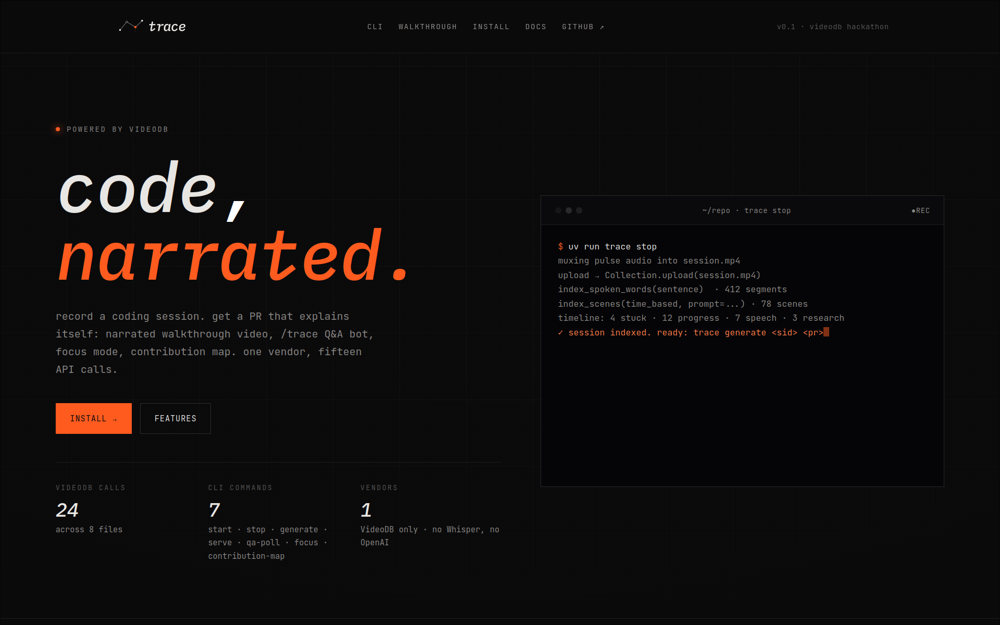

# trace

[](https://www.python.org/downloads/)
[](https://videodb.io)
[](LICENSE)
[](https://hackday.videodb.io)
[](https://docs.astral.sh/uv/)

> `trace start` → code → `trace stop` → your PR explains itself.

**trace** watches your coding session (screen + mic), indexes everything through VideoDB, and decorates the resulting GitHub PR with a narrated walkthrough video, a context-aware description, a reviewer Q&A bot, and a human vs AI contribution map — all powered by one vendor: VideoDB.

Built for the [VideoDB "Give Agents Eyes and Ears" hackathon](https://hackday.videodb.io) (May 16–18, 2026).

**Repo:** https://github.com/crypticsaiyan/trace

**Demo:** The walkthrough video was recorded using trace on https://github.com/crypticsaiyan/trace-test — that repo is the project being captured in the demo session.

---

## Screenshots




---

## What it does

```
trace start --project /path/to/repo [--live]
    captures screen with wf-recorder, mic with ffmpeg+pulse (Linux/Wayland)
    or the official VideoDB Capture SDK (macOS / Windows)
    streams 15s chunks live to VideoDB (--live) for real-time indexing
    watches inotify saves + hyprctl active window during session

trace stop
    finalizes capture, muxes audio into mp4
    uploads to VideoDB, runs index_spoken_words + index_scenes with a
    custom classifier prompt
    builds a tagged timeline (stuck / research / progress / speech moments)

trace generate <session_id> [pr_url]
    with pr_url: selects clips, generates FLUX intro card, voice-cloned
    narration (OmniVoice), ambient music, assembles on editor.Timeline,
    posts HLS stream URL to PR
    without pr_url: auto-commits staged changes, pushes branch, opens PR
    with AI title/body, then runs the full generate pipeline

trace serve
    runs a FastAPI web server: GET / (landing), GET /docs, GET /api/sessions
    pair with `trace qa-poll` for the /trace reviewer bot

trace qa-poll <pr_url> <session_id>
    polls the PR for /trace mentions
    runs semantic search across indexed spoken_word + scene indexes
    replies with up to 3 bounded clip URLs + paraphrased answers
```

Inspection commands: `trace sessions`, `trace inspect <id>`, `trace timeline <id>`, `trace transcript <id>`, `trace focus`, `trace contribution-map`, `trace pr-description`.

---

## Architecture

```
trace start                trace stop              trace generate
     │                          │                        │
     ▼                          ▼                        ▼
CaptureService          IndexingPipeline          PRVideoGenerator
wf-recorder +           upload mp4 →              ClipSelector (30–90s)
ffmpeg pulse            VideoDB                   NarrationBuilder
     │                  index_spoken_words        Renderer (3 tracks)
     │                  index_scenes                   │
     ▼                  TimelineBuilder                ▼
LiveIndexer (--live)    4 classifiers             editor.Timeline
15s chunks →            progress/stuck/           VideoAsset + AudioAsset
VideoDB upload          research/speech           + ImageAsset (FLUX)
                             │                         │
                             ▼                         ▼
                        ~/.trace/sessions/        PR comment (HLS URL)
                        metadata.json             PR description
                        timeline.json             contribution map
                        transcript.json           focus mode comment
```

### VideoDB API surface used

| API | File | Purpose |
|---|---|---|
| `videodb.connect` | `trace_cli/videodb/client.py` | Auth |
| `Collection.upload(file_path)` | `indexing/pipeline.py` + `capture/live_indexer.py` | Session video + 15s live chunks |
| `Collection.generate_text(prompt, model='pro')` | `pr_video/narration.py`, `pr_description/generator.py` | Narration script + PR description |
| `Collection.generate_voice(text)` | `pr_video/render.py` | Per-clip TTS via OmniVoice |
| `Collection.generate_image(prompt)` | `pr_video/render.py` | FLUX intro title card (16:9) |
| `Collection.generate_music(prompt)` | `pr_video/render.py` | Ambient background music |
| `Video.index_spoken_words(SegmentationType.sentence)` | `indexing/pipeline.py` | Transcript for narration + Q&A |
| `Video.index_scenes(SceneExtractionType.time_based, prompt=...)` | `indexing/pipeline.py` | Visual classification with custom prompt |
| `Video.get_scene_index(scene_index_id)` | `videodb/client.py` | Scene grounding for narration |
| `Video.search(IndexType.spoken_word, semantic)` | `web/qa.py` | Reviewer Q&A search |
| `Video.search(IndexType.scene, semantic)` | `web/qa.py` | Visual semantic search |
| `Video.generate_stream(timeline=[(s,e)])` | `web/qa.py` | Bounded HLS clip URLs |
| `videodb.editor.Timeline + Track + Clip` | `pr_video/render.py` | PR video assembly |
| `videodb.editor.VideoAsset` | `pr_video/render.py` | Source clips on video track |
| `videodb.editor.AudioAsset` | `pr_video/render.py` | Narration + music tracks |
| `videodb.editor.ImageAsset` | `pr_video/render.py` | FLUX intro title card |
| `videodb.editor.TextAsset + Font + Background + Position` | `pr_video/render.py` | Category + filename badges |
| `videodb.editor.Transition` | `pr_video/render.py` | Fade in/out between clips |
| `Timeline.generate_stream()` | `pr_video/render.py` | Final HLS m3u8 posted to PR |

15 distinct VideoDB API surfaces across 8 files.

---

## Install

```bash
git clone https://github.com/crypticsaiyan/trace
cd trace
uv sync
```

Required environment variables in `.env` at the repo root:

```
VIDEODB_API_KEY=...
GITHUB_TOKEN=...
```

**Linux (Wayland/Hyprland)** — system dependencies:

```bash
sudo pacman -S --needed ffmpeg wf-recorder inotify-tools
# or on Ubuntu/Debian:
sudo apt install ffmpeg wf-recorder inotify-tools
```

**macOS** — uses the official VideoDB Capture SDK:

```bash
uv sync --extra macos
# no system dependencies needed — the SDK handles screen + mic natively
```

**Windows** — uses the official VideoDB Capture SDK:

```bash
uv sync --extra windows
```

Claim your hackathon sandbox credits at [hackday.videodb.io/sandbox.html](https://hackday.videodb.io/sandbox.html).

### Voice generation provider

**Provider:** VideoDB OmniVoice (`SandboxModel.OMNIVOICE`)

**Model/settings:** `response_format=wav`, voice cloning via `ref_audio` + `ref_text` for consistent identity across clips, 4 parallel workers.

**How to switch:** Replace the three `collection.generate_voice(...)` calls in [trace_cli/pr_video/render.py](trace_cli/pr_video/render.py) (labelled: reference voice, per-clip, intro). Each call must produce a VideoDB audio asset — upload your provider's output via `collection.upload(file_path=..., media_type="audio")` and place the returned asset id on the narration track.

---

## Quickstart

Record a 2–3 minute coding session on a real project:

```bash
mkdir -p /tmp/demo && cd /tmp/demo
git init && echo "def hello(): pass" > greet.py

# Terminal 1 — start recording
# --live streams 15s chunks to VideoDB as you code
uv run trace start --project /tmp/demo --live

# code in another window, talk out loud while editing

# Terminal 2 — when done
uv run trace stop
```

Generate the PR video against a real GitHub PR:

```bash
# push your branch, open the PR, then:
uv run trace generate <session_id> https://github.com/you/repo/pull/N
```

Or let trace do everything — commit, push, open PR, and generate:

```bash
uv run trace generate <session_id>
```

Run the `/trace` reviewer Q&A bot (long-running):

```bash
# poll mode — watch a specific PR:
uv run trace qa-poll https://github.com/you/repo/pull/N <session_id>

# web server (landing page + /api/sessions):
uv run trace serve
```

Any reviewer comment containing `/trace what about X` triggers a semantic search against the indexed session and posts a reply with up to 3 bounded clip URLs.

---

## Features

### Narrated PR video
Selects 30–90s of the most relevant session clips (progress moments whose evidence files appear in the PR diff), generates a narration script grounded in the scene index and spoken-word transcript, synthesizes voice via OmniVoice, and assembles a three-track `editor.Timeline` (video / narration / ambient music) with a FLUX-generated intro card and text badge overlays.

### Reviewer Q&A (`/trace`)
Polls the PR for comments containing `/trace <question>`. Runs dual semantic search (spoken-word + scene indexes) and replies with a text answer plus up to 3 bounded HLS clip URLs scoped to the relevant moments.

### Human vs Agent contribution map
Scans Claude Code session logs within the capture window, classifies each PR diff line as `human`, `agent`, `mixed`, or `unknown`, and posts a per-file summary comment.

### Reviewer Focus Mode
Identifies files touched by `stuck` timeline moments and files with ≥50 changed lines, and posts a prioritized review guide so reviewers know where to look first.

### Context-aware PR description
Generates a What / Why / Struggles / Follow-ups description from the session transcript and timeline, appended below the existing PR description without modifying it.

### Tagged timeline
Four classifiers (progress, stuck, research, speech) run over the indexed session. The merger produces a contiguous, gap-free timeline stored in `~/.trace/sessions/<id>/timeline.json`. The clip selector and narration builder consume this timeline to pick the most meaningful moments for the PR video.

---

## Architecture notes

**Why pseudo-live chunked upload instead of CaptureSession.** VideoDB's official Capture SDK only ships wheels for macOS and Windows. On Linux Wayland (Hyprland) the SDK is uninstallable. Instead, trace runs a `LiveIndexer` thread (`--live` flag) that cuts the in-progress mp4 every 15 seconds, uploads each chunk via `Collection.upload`, and indexes each one with `index_scenes` + `index_spoken_words`. Same VideoDB surfaces light up, no public RTSP tunnel required.

**Why VideoDB-only generative stack.** Hackathon judging weights 30% on depth of VideoDB usage. We use `Video.index_spoken_words` for transcript, `Collection.generate_text` (basic / pro / ultra tiers) for narration script and PR description, `Collection.generate_voice` for TTS, `Collection.generate_image` for the FLUX intro card, and `Collection.generate_music` for ambient audio. One vendor, maximum API surface.

**Why scene-grounded narration.** Earlier versions had the narration LLM hallucinate technical details the developer never said and the screen never showed. We now pass the per-clip slice of the VideoDB scene index (label, files, errors, summary) into the prompt with explicit anti-hallucination rules, so narration only describes what the eyes-and-ears layer actually saw.

---

## Repo layout

```
trace_cli/
  cli.py                     typer entry (start, stop, generate, serve, qa-poll,
                             focus, contribution-map, pr-description, sessions,
                             inspect, timeline, transcript)
  credentials.py             env var loading + key redaction
  videodb/client.py          single VideoDB facade
  github/client.py           PR URL validator + comment / diff / description ops
  session/
    models.py                pydantic SessionMetadata, Heartbeat, Transcript, Timeline
    store.py                 ~/.trace/sessions/ on-disk layout
    manager.py               start / stop lifecycle, active-session lock
    ids.py                   UUID v4 helpers
  capture/
    service.py               platform dispatch (Linux / macOS / Windows)
    service_mac.py           VideoDB Capture SDK (macOS)
    service_windows.py       VideoDB Capture SDK (Windows)
    platform.py              SaveWatcher + WindowPoller abstractions
    heartbeat.py             5s heartbeat writer
    watchers.py              inotify file save watcher + hyprctl window poller
    live_indexer.py          15s chunk upload + index thread (--live mode)
  indexing/
    pipeline.py              mux audio + upload + spoken/scene index + transcript fetch
  timeline/
    builder.py               boundary merger + priority resolution
    classifiers/__init__.py  progress / speech / research / stuck
    build_for_session.py     glue: load session data, run classifiers, persist
  pr_video/
    selector.py              per-moment clip selection (30–90s budget)
    narration.py             scene + transcript grounded scripts
    render.py                editor.Timeline with 3 tracks: video / audio / badges
    generator.py             end-to-end orchestration
    ship.py                  auto-commit + push + open PR logic (internal, used by generate)
    preview.py               thumbnail capture + local preview helpers
  focus_mode/
    builder.py               reviewer Focus Mode ranking
  contribution_map/
    scanner.py               read Claude Code session logs in the capture window
    mapper.py                classify diff lines as human / agent / mixed / unknown
  pr_description/
    generator.py             What / Why / Struggles / Follow-ups
  web/
    app.py                   FastAPI web server + /webhook/github
    qa.py                    /trace polling bot + semantic search
  decision_replay/
    service.py               file+line range → session intervals
  anthropic_client/          Anthropic Claude wrapper
  openai_clients/            Whisper + TTS wrappers
  utils/                     shared helpers
landing/                     static landing page (Vercel)
tests/
  unit/                      pytest unit tests
  property/                  Hypothesis property tests
  integration/               opt-in tests hitting real external services
```

---

## License

MIT.
