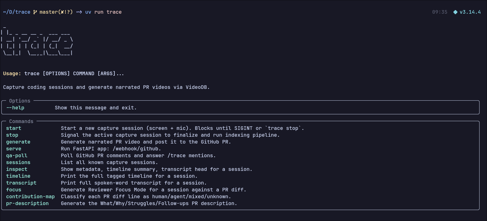

# trace

[](https://www.python.org/downloads/)
[](https://videodb.io)
[](LICENSE)
[](https://hackday.videodb.io)
[](https://docs.astral.sh/uv/)

> Record your coding session. Stop. Your PR explains itself.



**trace** gives your pull requests a memory. It watches your screen and mic while you code, indexes everything through VideoDB, and when you open a PR it posts a narrated walkthrough video, a context-aware description, a reviewer Q&A bot, and a human vs AI contribution map — all from one session recording.

**Demo Repo:** [trace-test](https://github.com/crypticsaiyan/trace-test)

## What it is

trace gives your pull requests a memory. Run `trace start` before you code and `trace stop` when you're done. That's it — everything else is automatic.

During the session, trace captures your screen and mic, streaming 15-second chunks to VideoDB in real time. On stop, it muxes the audio, uploads the full session, and runs `index_spoken_words` + `index_scenes` with a custom classifier prompt to build a tagged timeline of progress, stuck, research, and speech moments.

When you open a PR, `trace generate` selects the most relevant clips from that timeline, generates a narration script grounded in the scene index and spoken transcript, synthesizes voice via OmniVoice, adds a FLUX-generated intro card and ambient music, and assembles everything on a `videodb.editor.Timeline` with three composed tracks. The resulting HLS stream URL is posted directly to the PR.

The session stays queryable. Reviewers comment `/trace <question>` and get a text answer plus up to three bounded clip URLs, powered by dual semantic search across the spoken-word and scene indexes.

VideoDB is the only vendor: capture, indexing, search, `generate_text`, `generate_voice`, `generate_image`, `generate_music`, and `editor.Timeline` — 15 distinct API surfaces across 8 files.

## How it works

```
trace start   →   trace stop   →   trace generate
   record            index              ship
```

| Step | What happens |
|---|---|
| `trace start --project <dir> [--live]` | Records screen + mic. On Linux: wf-recorder + ffmpeg/pulse. On macOS/Windows: VideoDB Capture SDK. `--live` uploads 15s chunks to VideoDB as you code. |
| `trace stop` | Finalizes recording, uploads to VideoDB, runs `index_spoken_words` + `index_scenes`, builds a tagged timeline (progress / stuck / research / speech). |
| `trace generate <session_id> [pr_url]` | Selects clips, generates narration via OmniVoice, assembles a 3-track `editor.Timeline` with FLUX intro card + ambient music, posts HLS URL to PR. Omit `pr_url` to auto-commit, push, and open the PR. |
| `trace qa-poll <pr_url> <session_id>` | Long-running: polls PR comments for `/trace <question>`, runs dual semantic search (spoken-word + scene), replies with answer + up to 3 bounded clip URLs. |
| `trace serve` | FastAPI server: landing page, docs, `/api/sessions`. |

Additional commands: `trace sessions`, `trace inspect`, `trace timeline`, `trace transcript`, `trace focus`, `trace contribution-map`, `trace pr-description`.

---

## Features

**Narrated PR video** — Clips are selected from `progress` moments whose files appear in the diff. Narration is grounded in the scene index and spoken transcript (no hallucination). Three-track `editor.Timeline`: video / OmniVoice narration / ambient music. FLUX-generated intro title card. Posted to the PR as an HLS stream URL.

**Reviewer Q&A (`/trace`)** — Any reviewer can comment `/trace why did you remove the cache?`. trace runs semantic search across both the spoken-word and scene indexes and replies with a synthesized answer + up to 3 timestamped clip URLs.

**Human vs Agent contribution map** — Scans Claude Code session logs within the capture window, classifies each PR diff line as `human`, `agent`, `mixed`, or `unknown`, posts a per-file summary.

**Reviewer Focus Mode** — Ranks files by `stuck` moments and change size, posts a prioritized review guide.

**Context-aware PR description** — Generates What / Why / Struggles / Follow-ups from the transcript and timeline, appended to the PR description.

---

## Install

```bash
git clone https://github.com/crypticsaiyan/trace
cd trace
uv sync
```

`.env` at repo root:

```
VIDEODB_API_KEY=...
GITHUB_TOKEN=...
```

**Linux (Wayland):**
```bash
sudo pacman -S --needed ffmpeg wf-recorder inotify-tools
# Ubuntu/Debian: sudo apt install ffmpeg wf-recorder inotify-tools
```

**macOS:**
```bash
uv sync --extra macos
```

**Windows:**
```bash
uv sync --extra windows
```

### Voice generation

**Provider:** VideoDB OmniVoice (`SandboxModel.OMNIVOICE`)  
**Settings:** WAV output, voice cloning via `ref_audio` + `ref_text`, 4 parallel workers for per-clip TTS.  
**To swap providers:** Replace the three `collection.generate_voice(...)` calls in [trace_cli/pr_video/render.py](trace_cli/pr_video/render.py) (labelled: reference voice, per-clip, intro). Upload your provider's audio file via `collection.upload(file_path=..., media_type="audio")` and use the returned asset id on the narration track.

---

## Quickstart

```bash
# 1. Record. --live streams 15s chunks to VideoDB as you code.
uv run trace start --project /path/to/your/repo --live

# ... code, talk out loud, make commits ...

# 2. Stop + index. Uploads to VideoDB, indexes spoken words + scenes, builds timeline.
uv run trace stop

# 3a. Auto-ship: commit staged changes, push, open PR, post narrated video.
uv run trace generate <session_id>

# 3b. Or against an existing PR:
uv run trace generate <session_id> https://github.com/you/repo/pull/N

# 4. Reviewer Q&A bot — polls PR for /trace mentions, replies with clip URLs.
uv run trace qa-poll https://github.com/you/repo/pull/N <session_id>

# 5. Web server — landing page + /api/sessions.
uv run trace serve

# --- Inspection ---

# List all sessions.
uv run trace sessions

# Metadata + timeline summary + transcript head.
uv run trace inspect <session_id>

# Full tagged timeline (progress / stuck / research / speech).
uv run trace timeline <session_id>

# Full spoken-word transcript.
uv run trace transcript <session_id>

# --- Standalone PR decorations ---

# Reviewer Focus Mode: rank files by stuck moments, post review guide.
uv run trace focus <session_id> --pr https://github.com/you/repo/pull/N --post

# Human vs Agent contribution map: classify each diff line, post summary.
uv run trace contribution-map <session_id> --pr https://github.com/you/repo/pull/N --post

# What/Why/Struggles/Follow-ups PR description.
uv run trace pr-description <session_id> --pr https://github.com/you/repo/pull/N --post
```

---

## VideoDB API surface

15 distinct surfaces across 8 files.

| API | Purpose |
|---|---|
| `videodb.connect` | Auth |
| `Collection.upload(file_path)` | Session video + 15s live chunks |
| `Collection.generate_text(prompt, model='pro')` | Narration scripts + PR description |
| `Collection.generate_voice(text)` | Per-clip TTS via OmniVoice |
| `Collection.generate_image(prompt)` | FLUX intro title card (16:9) |
| `Collection.generate_music(prompt)` | Ambient background music |
| `Video.index_spoken_words(SegmentationType.sentence)` | Transcript for narration + Q&A |
| `Video.index_scenes(SceneExtractionType.time_based, prompt=...)` | Visual classification |
| `Video.get_scene_index(scene_index_id)` | Scene grounding for narration |
| `Video.search(IndexType.spoken_word, semantic)` | Q&A spoken search |
| `Video.search(IndexType.scene, semantic)` | Q&A visual search |
| `Video.generate_stream(timeline=[(s,e)])` | Bounded HLS clip URLs |
| `editor.Timeline + Track + Clip` | PR video assembly |
| `editor.VideoAsset / AudioAsset / ImageAsset / TextAsset` | Track assets + badges |
| `Timeline.generate_stream()` | Final HLS m3u8 posted to PR |

---

## Architecture

```
trace start                trace stop              trace generate
     │                          │                        │
     ▼                          ▼                        ▼
CaptureService          IndexingPipeline          PRVideoGenerator
wf-recorder +           upload mp4 →              ClipSelector (30–90s)
ffmpeg pulse            VideoDB                   NarrationBuilder
     │                  index_spoken_words        Renderer (3 tracks)
     │                  index_scenes                   │
     ▼                  TimelineBuilder                ▼
LiveIndexer (--live)    4 classifiers             editor.Timeline
15s chunks →            progress/stuck/           VideoAsset + AudioAsset
VideoDB upload          research/speech           + ImageAsset (FLUX)
                             │                         │
                             ▼                         ▼
                        ~/.trace/sessions/        PR comment (HLS URL)
                        metadata.json             PR description
                        timeline.json             contribution map
                        transcript.json           focus mode comment
```

**Why chunked live upload instead of CaptureSession:** VideoDB's Capture SDK has no Linux wheel. On Linux Wayland, trace runs a `LiveIndexer` thread that cuts the in-progress mp4 every 15s, uploads via `Collection.upload`, and indexes each chunk. Same API surfaces, no RTSP tunnel needed.

**Why scene-grounded narration:** Earlier builds hallucinated function names and errors the developer never mentioned. The narration prompt now receives the per-clip scene index slice (label, files, errors, summary) with explicit anti-hallucination rules.

---

## License

MIT.
